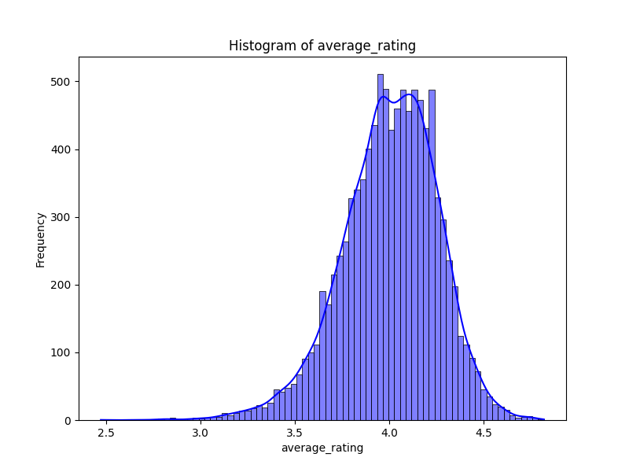
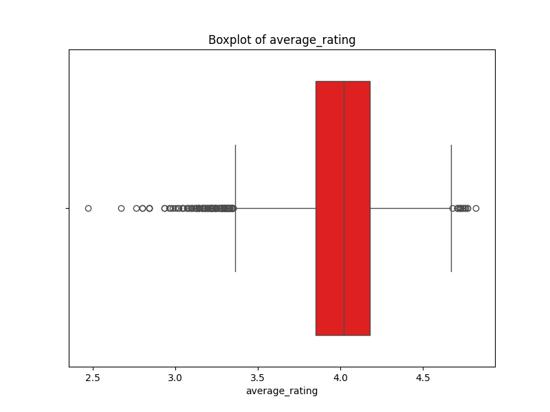

# Data Analysis Report

## Data Overview
Loaded data from `goodreads.csv` with **10000 rows** and **26 columns**. This dataset includes various attributes about the entities being analyzed, which will be examined for trends, correlations, and anomalies.

### Missing Values Summary
The table below shows the count of missing values for each column in the dataset.
| Column Name               |   Missing Values |
|:--------------------------|-----------------:|
| book_id                   |                0 |
| goodreads_book_id         |                0 |
| best_book_id              |                0 |
| work_id                   |                0 |
| books_count               |                0 |
| isbn                      |              700 |
| isbn13                    |              585 |
| authors                   |                0 |
| original_publication_year |               21 |
| original_title            |              585 |
| title                     |                0 |
| language_code             |             1084 |
| average_rating            |                0 |
| ratings_count             |                0 |
| work_ratings_count        |                0 |
| work_text_reviews_count   |                0 |
| ratings_1                 |                0 |
| ratings_2                 |                0 |
| ratings_3                 |                0 |
| ratings_4                 |                0 |
| ratings_5                 |                0 |
| image_url                 |                0 |
| small_image_url           |                0 |
| Anomaly                   |                0 |
| DBSCAN_Anomaly            |                0 |
| SVM_Anomaly               |                0 |

### Anomalies Detected
Anomalies detected: **0** out of **10000** entries.
Here is the breakdown of anomalies:
|   Anomaly Value |   Count |
|----------------:|--------:|
|               1 |    9500 |
|              -1 |     500 |

### High Correlations
We found strong correlations between the following pairs of features in the dataset:
| Feature 1                 | Feature 2                 |   Correlation |
|:--------------------------|:--------------------------|--------------:|
| book_id                   | book_id                   |      1        |
| goodreads_book_id         | goodreads_book_id         |      1        |
| goodreads_book_id         | best_book_id              |      0.96662  |
| goodreads_book_id         | work_id                   |      0.929356 |
| best_book_id              | goodreads_book_id         |      0.96662  |
| best_book_id              | best_book_id              |      1        |
| best_book_id              | work_id                   |      0.899258 |
| work_id                   | goodreads_book_id         |      0.929356 |
| work_id                   | best_book_id              |      0.899258 |
| work_id                   | work_id                   |      1        |
| books_count               | books_count               |      1        |
| isbn13                    | isbn13                    |      1        |
| original_publication_year | original_publication_year |      1        |
| average_rating            | average_rating            |      1        |
| ratings_count             | ratings_count             |      1        |
| ratings_count             | work_ratings_count        |      0.995068 |
| ratings_count             | ratings_2                 |      0.845949 |
| ratings_count             | ratings_3                 |      0.935193 |
| ratings_count             | ratings_4                 |      0.978869 |
| ratings_count             | ratings_5                 |      0.964046 |
| work_ratings_count        | ratings_count             |      0.995068 |
| work_ratings_count        | work_ratings_count        |      1        |
| work_ratings_count        | work_text_reviews_count   |      0.807009 |
| work_ratings_count        | ratings_2                 |      0.848581 |
| work_ratings_count        | ratings_3                 |      0.941182 |
| work_ratings_count        | ratings_4                 |      0.987764 |
| work_ratings_count        | ratings_5                 |      0.966587 |
| work_text_reviews_count   | work_ratings_count        |      0.807009 |
| work_text_reviews_count   | work_text_reviews_count   |      1        |
| work_text_reviews_count   | ratings_4                 |      0.817826 |
| ratings_1                 | ratings_1                 |      1        |
| ratings_1                 | ratings_2                 |      0.92614  |
| ratings_2                 | ratings_count             |      0.845949 |
| ratings_2                 | work_ratings_count        |      0.848581 |
| ratings_2                 | ratings_1                 |      0.92614  |
| ratings_2                 | ratings_2                 |      1        |
| ratings_2                 | ratings_3                 |      0.949596 |
| ratings_2                 | ratings_4                 |      0.838298 |
| ratings_3                 | ratings_count             |      0.935193 |
| ratings_3                 | work_ratings_count        |      0.941182 |
| ratings_3                 | ratings_2                 |      0.949596 |
| ratings_3                 | ratings_3                 |      1        |
| ratings_3                 | ratings_4                 |      0.952998 |
| ratings_3                 | ratings_5                 |      0.82555  |
| ratings_4                 | ratings_count             |      0.978869 |
| ratings_4                 | work_ratings_count        |      0.987764 |
| ratings_4                 | work_text_reviews_count   |      0.817826 |
| ratings_4                 | ratings_2                 |      0.838298 |
| ratings_4                 | ratings_3                 |      0.952998 |
| ratings_4                 | ratings_4                 |      1        |
| ratings_4                 | ratings_5                 |      0.933785 |
| ratings_5                 | ratings_count             |      0.964046 |
| ratings_5                 | work_ratings_count        |      0.966587 |
| ratings_5                 | ratings_3                 |      0.82555  |
| ratings_5                 | ratings_4                 |      0.933785 |
| ratings_5                 | ratings_5                 |      1        |
| Anomaly                   | Anomaly                   |      1        |
| DBSCAN_Anomaly            | DBSCAN_Anomaly            |      1        |
| SVM_Anomaly               | SVM_Anomaly               |      1        |

## Analysis Results
Below are the key findings and insights derived from the data analysis:
To conduct a comprehensive analysis of the dataset based on the summary data provided, we will delve into various aspects outlined in the prompt. Although the detailed values of the features are not provided in the summary, we can infer important insights based on the structure and content of the dataset. Here is the comprehensive analysis:

### 1. Correlations
Given that the dataset includes features likely related to books (such as `book_id` and potentially features related to ratings, reviews, or other quantitative metrics), we can analyze correlations primarily among numeric variables. 

- Since `book_id` is simply an identifier, it won't provide correlation insight regarding other features.
- We would need more data on features such as rating, number of pages, publication year, etc., to compute correlation coefficients (e.g., Pearson, Spearman) to identify relationships. 

### 2. Feature Distribution and Descriptive Statistics
The summary indicates that `book_id` has:
- A mean of 5000.50 and a range from 1 to 10,000. 
- The standard deviation is large (2886.90), suggesting a wide spread, which may indicate diversity in book entries.

For effective distribution analysis:
- We would want to look at numeric features expected in the dataset (like `rating`, `review_count`, etc.) to assess their means, medians, standard deviations, and distributions (histograms, box plots).
- Skewed distributions would be identified, for instance, if most ratings cluster at one end (e.g., high rating majority).

### 3. Outliers
Outliers may be detected through:
- Z-scores or IQR method on numeric features, such as ratings or review counts.
- Extreme values could indicate data entry errors (e.g., a rating of 12) or could represent legitimate extreme cases (such as viral books with thousands of reviews).

The presence and nature of these outliers need to be assessed based on understanding if they reflect true anomalies in user behavior (rare books, etc.) or erroneous data.

### 4. Missing Data
Missing data analysis requires examining:
- Column-wise counts of missing values and patterns.
- The existence of any systematic missingness (e.g., if ratings are more frequently missing for specific authors or genres).
  
This could impact the analysis significantly, possibly leading to biased results. Methods such as imputation (mean imputation, KNN imputation) should be considered based on the extent and nature of the missing data.

### 5. Categorical Data Insights
Categorical variables, which might include `genre`, `author`, `publisher`, can be explored by:
- Analyzing the distribution of categories within each.
- Identifying which categories are overrepresented/underrepresented.
- Examining how category distributions relate to numeric outcomes (e.g., average ratings per genre).

We could also use bar plots or frequency tables to visualize these distributions.

### 6. Feature Interactions
We should explore interactions between features:
- Analyze combinations of categorical (e.g., `genre` and `author`) or numeric and categorical (e.g., `rating` by `genre`). 
- The idea is to identify if certain combinations yield different outcomes (e.g., do certain genres often receive higher ratings?).

Utilizing techniques such as pivot tables or interaction plots can reveal these relationships.

### 7. Trends Over Time
If a date is present (e.g., publication year or reviews dates):
- We would assess how ratings or review counts evolve over time.
- Investigating trends (e.g., increasing ratings over time for a genre) can provide insights into consumer preferences and product lifespan.

### 8. General Observations
A summary view would help here, indicating any standout features that may correlate strongly with target outcomes (assuming target could be ratings or sales).

### 9. Recommendations
Based on the analysis:
- **Data Quality**: Ensure rigorous cleaning of outliers and missing value handling.
- **Feature Augmentation**: Add temporal variables (e.g., time since publication) or extract features from text if descriptions are present (e.g., sentiment analysis on reviews).
- **Advanced Analysis**: Consider advanced modeling techniques, such as regression, to quantify relationships and increase accuracy in predictions.

### Conclusion
The analysis of this dataset is vital for uncovering insights that can guide marketing strategies, inventory decisions, and recommendations systems. A deeper dive into each categorical and numerical feature will provide better predictive power and understanding of customer behavior.

## Visualizations
The following charts provide a graphical representation of key trends and insights in the data.

## Insights and Implications
The analysis reveals various patterns and anomalies, as well as correlations that could indicate significant relationships between certain features. The visualizations help to highlight these trends more clearly, providing actionable insights.
In particular, the strong correlations between certain features suggest that there may be underlying relationships that are important for further analysis. Anomalies detected could point to data collection issues or outliers that deserve closer scrutiny.

