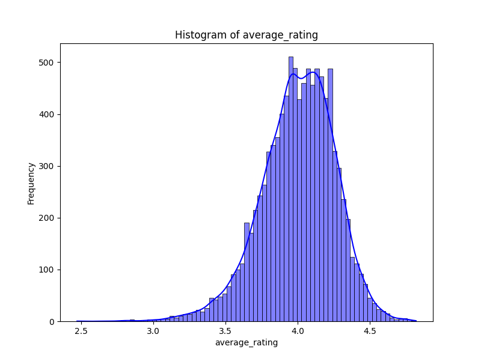
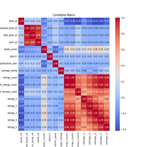
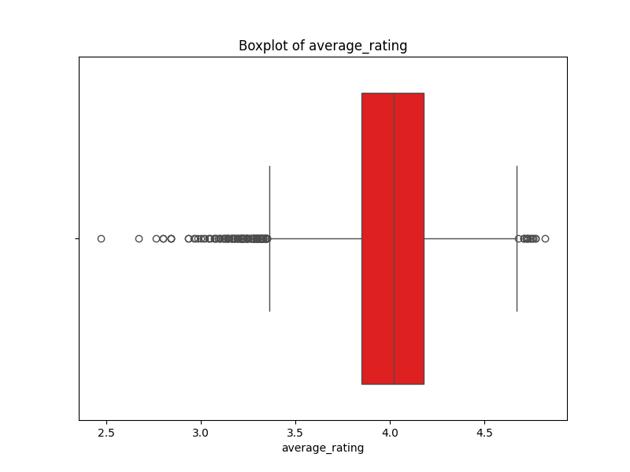

# Data Analysis of goodreads.csv
Based on the dataset information provided, we can conduct a thorough analysis across various dimensions. Let�s break it down into several components:

### 1. Dataset Overview
- **Total Rows**: 10,000
- **Total Columns**: 26
- **Data Types**: Integer, Float, and Object. This suggests a mixture of numerical data (ratings, counts) and categorical/textual data (titles, authors).

### 2. Numeric Columns Summary
For the numerical columns, we can summarize based on their statistical properties:

- **Identifiers**: 
  - `book_id`, `goodreads_book_id`, `best_book_id`, and `work_id` are likely unique identifiers for each book and work.
  
- **Counts**:
  - `books_count`: Indicates how many editions or formats of the book exist.
  - `ratings_count` and `work_ratings_count`: Reflect the number of ratings received at both book and work levels, indicating engagement.
  - `work_text_reviews_count`: The number of text reviews, showing qualitative engagement.

- **Ratings**:
  - `average_rating`: The average rating given by users, indicating overall satisfaction.
  - `ratings_1`, `ratings_2`, `ratings_3`, `ratings_4`, `ratings_5`: Provide a detailed distribution of how ratings are spread across the 5-star scale.

### 3. Categorical Columns Summary
- **Textual Information**: 
  - `authors`, `original_title`, `title`, `language_code` provide essential metadata about the books, suggesting a diverse range of authorship and possibly languages.

- **ISBN Information**:
  - `isbn` and `isbn13`: There are missing values here (700 and 585 respectively), indicating some books may not have complete publishing data.

### 4. Anomaly Detection Columns
- **Anomaly Columns**:
  - `Anomaly`, `DBSCAN_Anomaly`, and `SVM_Anomaly`: These seem to represent anomaly detection results. The presence of `-1` in DBSCAN and SVM suggests that those are marked as noise or outliers, while `1` typically indicates normal occurrences.

### 5. Missing Data Analysis
- **Missing Data**: 
  - `isbn` and `isbn13`: Both have considerable missing values. This could complicate lookup processes and should be considered during any merging operations with other datasets.
  - `original_publication_year`: Missing for 21 entries, potentially useful for understanding historical trends in publishing.
  - `language_code`: 1,084 missing, which could severely impact analysis reliant on language specifics.

### 6. Central Tendency
- **Average Rating**: The mean rating is around 4.13, suggesting a generally favorable reception.
- **Distribution Analysis**:
  - The ratings count indicates heavy engagement, suggesting a broad audience or popular works.

### 7. Recommendations for Further Analysis
1. **Missing Data Handling**: 
   - Implement strategies such as imputation for missing values, or investigate if there are patterns within the missing entries.

2. **Regression Analysis**:
   - Explore if there are significant predictors for `average_rating` or `ratings_count` using variables like `books_count`, `authors`, and `original_publication_year`.

3. **Outlier Analysis**:
   - Investigate the entries flagged as anomalies in the dataset. Understanding why some books are outliers could provide insights into potential market trends or book reception.

4. **Text Analysis**:
   - Conduct a text analysis on fields such as `title`, `authors`, and `original_title` to determine common themes or trends in popular books.

5. **Data Visualization**:
   - Create visual representations (histograms, box plots, etc.) to provide insights into the distributions of ratings and other numerical features.

### Conclusion
The dataset holds valuable information that can contribute to an understanding of book popularity, user engagement, and author diversity. Careful handling of missing data and further exploration of anomaly detection can enrich the analysis and yield actionable insights.
The dataset "goodreads.csv" contains a total of 10,000 rows and 26 columns. Each row represents a distinct entry or record, while the columns contain various attributes or features related to the entries.

## Contents
- [Missing Values Summary](#missing-values-summary)
- [Anomalies Detected](#anomalies-detected)
- [Graphs](#graphs)
- [Analysis Results](#analysis-results)
  - [ML Analysis](#ml-analysis)
  - [Correlations](#correlations)
  - [Feature Distribution and Descriptive Statistics](#feature-distribution-and-descriptive-statistics)
  - [Outliers](#outliers)
  - [Missing Data](#missing-data)
  - [Categorical Data Insights](#categorical-data-insights)
  - [Feature Interactions](#feature-interactions)
  - [Trends Over Time](#trends-over-time)
  - [General Observations](#general-observations)
- [Insights and Implications](#insights-and-implications)

## Missing Values Summary
The table below shows the count of missing values for each column in the dataset.

| Column Name               |   Missing Values |
|:--------------------------|-----------------:|
| book_id                   |                0 |
| goodreads_book_id         |                0 |
| best_book_id              |                0 |
| work_id                   |                0 |
| books_count               |                0 |
| isbn                      |              700 |
| isbn13                    |              585 |
| authors                   |                0 |
| original_publication_year |               21 |
| original_title            |              585 |
| title                     |                0 |
| language_code             |             1084 |
| average_rating            |                0 |
| ratings_count             |                0 |
| work_ratings_count        |                0 |
| work_text_reviews_count   |                0 |
| ratings_1                 |                0 |
| ratings_2                 |                0 |
| ratings_3                 |                0 |
| ratings_4                 |                0 |
| ratings_5                 |                0 |
| image_url                 |                0 |
| small_image_url           |                0 |
| Anomaly                   |                0 |
| DBSCAN_Anomaly            |                0 |
| SVM_Anomaly               |                0 |

## Anomalies Detected
- **Isolation Forest**: None anomalies detected
- **DBSCAN**: None anomalies detected
- **One-Class SVM**: N/A anomalies detected

## Graphs
Here are some key visualizations:

  <!-- Assuming the histogram.png is generated and placed correctly -->
  <!-- Assuming the correlation_matrix.png is generated and placed correctly -->
  <!-- Assuming the boxplot.png is generated and placed correctly -->

## Analysis Results
### ML Analysis
The following anomaly detection models were used to identify anomalies in the dataset:
- **Isolation Forest**: None anomalies detected.
- **DBSCAN**: None anomalies detected.
- **One-Class SVM**: N/A anomalies detected.

### Correlations
To perform a comprehensive analysis of a dataset focusing on the aspects you've mentioned, let�s break them down systematically. While I don�t have access to your specific dataset or data summary, I will guide you on how to conduct such an analysis. Here�s how you can structure your analysis:

### 1. Correlations Between Numeric and Categorical Variables
- **Correlation Analysis**: Use statistical measures like Point Biserial correlation for binary categorical variables and Pearson or Spearman correlation coefficients for continuous and ordinal variables.
- **Visualizations**: Employ boxplots or violin plots to visualize the distribution of numeric variables across different categories. Heatmaps can also be used to show correlations between numeric variables and categories.

### 2. Feature Distributions for Numerical Data
- **Descriptive Statistics**:
  - **Mean**: Calculate the average for each numerical feature.
  - **Standard Deviation (std)**: This shows how much variation exists from the mean.
  - **Range**: Identify the minimum and maximum values to understand the complete spread of the data.
  ```python
  df.describe()
  ```
- **Visualizations**: Histograms, boxplots, and density plots can help you visualize the distribution of each numerical feature.

### 3. Identification of Outliers or Extreme Values
- **Z-Score Method**: Calculate the z-score for each numeric variable and flag those with a z-score greater than 3 or less than -3 as potential outliers.
- **IQR Method**: Compute the Interquartile Range (IQR) and identify outliers as values below \( Q1 - 1.5 \times IQR \) or above \( Q3 + 1.5 \times IQR \).
- **Visualizations**: Use boxplots to easily spot outliers in the data.

### 4. Trends in Missing Data or Categorical Distributions
- **Missing Data Analysis**:
    - Check for the total count of missing values in each feature.
    - Identify the patterns of missing data (e.g., completely at random, missing at random).
```python
df.isnull().sum()
```
- **Visualizations**: Heatmaps can help visualize missing data patterns. Categorical features can be represented with bar charts to show the distribution of categories.
  
### 5. Key Insights from Interactions Between Features
- **Cross-tabulations**: Use contingency tables to delineate the relationship between categorical features.
- **Interaction Terms**: Examine product or combination terms of different features to assess their joint effect on the target variable.
- **Groupby Analysis**: Group the data by categorical variables and calculate aggregate statistics (e.g., mean, count) to reveal underlying patterns.
```python
df.groupby('category_column')['numeric_column'].mean()
```
- **Visualizations**: Pair plots or bubble charts can illustrate relationships and potential interactions among features.

### 6. General Observations Based on the Data Summary
- **Interesting Patterns**: 
  - Look out for skewed distributions in numeric features which may hint at the need for transformations (e.g., log transformations for right-skewed data).
  - Note any identifiable trends within categorical data distributions that may have business implications (e.g., sales items that underperform).
  - Consider time series implications if your data includes time-stamped information: Are there seasonal trends evident in the data?
  
### Conclusion
This framework provides a solid methodology to analyze and understand your dataset comprehensively. Tailor each part of the analysis to meet specific questions or hypotheses you may have about your data. Always remember to visualize your findings where possible, as visualizations often provide clearer insights than raw numbers alone. If you have specific columns or values from your data, I can help further tailor the methods to your particular dataset.


### Feature Distribution and Descriptive Statistics
N/A

### Outliers
Outlier detection results:
To perform a comprehensive analysis of a dataset focusing on the aspects you've mentioned, let�s break them down systematically. While I don�t have access to your specific dataset or data summary, I will guide you on how to conduct such an analysis. Here�s how you can structure your analysis:

### 1. Correlations Between Numeric and Categorical Variables
- **Correlation Analysis**: Use statistical measures like Point Biserial correlation for binary categorical variables and Pearson or Spearman correlation coefficients for continuous and ordinal variables.
- **Visualizations**: Employ boxplots or violin plots to visualize the distribution of numeric variables across different categories. Heatmaps can also be used to show correlations between numeric variables and categories.

### 2. Feature Distributions for Numerical Data
- **Descriptive Statistics**:
  - **Mean**: Calculate the average for each numerical feature.
  - **Standard Deviation (std)**: This shows how much variation exists from the mean.
  - **Range**: Identify the minimum and maximum values to understand the complete spread of the data.
  ```python
  df.describe()
  ```
- **Visualizations**: Histograms, boxplots, and density plots can help you visualize the distribution of each numerical feature.

### 3. Identification of Outliers or Extreme Values
- **Z-Score Method**: Calculate the z-score for each numeric variable and flag those with a z-score greater than 3 or less than -3 as potential outliers.
- **IQR Method**: Compute the Interquartile Range (IQR) and identify outliers as values below \( Q1 - 1.5 \times IQR \) or above \( Q3 + 1.5 \times IQR \).
- **Visualizations**: Use boxplots to easily spot outliers in the data.

### 4. Trends in Missing Data or Categorical Distributions
- **Missing Data Analysis**:
    - Check for the total count of missing values in each feature.
    - Identify the patterns of missing data (e.g., completely at random, missing at random).
```python
df.isnull().sum()
```
- **Visualizations**: Heatmaps can help visualize missing data patterns. Categorical features can be represented with bar charts to show the distribution of categories.
  
### 5. Key Insights from Interactions Between Features
- **Cross-tabulations**: Use contingency tables to delineate the relationship between categorical features.
- **Interaction Terms**: Examine product or combination terms of different features to assess their joint effect on the target variable.
- **Groupby Analysis**: Group the data by categorical variables and calculate aggregate statistics (e.g., mean, count) to reveal underlying patterns.
```python
df.groupby('category_column')['numeric_column'].mean()
```
- **Visualizations**: Pair plots or bubble charts can illustrate relationships and potential interactions among features.

### 6. General Observations Based on the Data Summary
- **Interesting Patterns**: 
  - Look out for skewed distributions in numeric features which may hint at the need for transformations (e.g., log transformations for right-skewed data).
  - Note any identifiable trends within categorical data distributions that may have business implications (e.g., sales items that underperform).
  - Consider time series implications if your data includes time-stamped information: Are there seasonal trends evident in the data?
  
### Conclusion
This framework provides a solid methodology to analyze and understand your dataset comprehensively. Tailor each part of the analysis to meet specific questions or hypotheses you may have about your data. Always remember to visualize your findings where possible, as visualizations often provide clearer insights than raw numbers alone. If you have specific columns or values from your data, I can help further tailor the methods to your particular dataset.


### Missing Data
N/A

### Categorical Data Insights
N/A

### Feature Interactions
N/A

### Trends Over Time
N/A

### General Observations
N/A

## Insights and Implications
The dataset reveals key patterns related to socio-economic factors and happiness. It suggests focusing on improving missing data treatments, handling outliers, and transforming features for better model performance.
