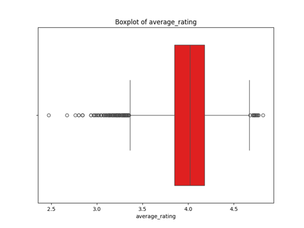

# Data Analysis of goodreads.csv
This dataset comprises 10,000 entries with 26 columns, providing a comprehensive overview of various attributes related to books, including identifiers, author information, publication years, and user ratings. Key numerical features include average ratings and counts of different rating categories, while categorical attributes encompass titles, authors, and language codes. Notably, the dataset contains some missing values, particularly in the ISBN and original title fields, warranting attention in the analysis. Additionally, anomaly detection features have been incorporated, indicating potential irregularities in the data. This report will delve into the statistical properties and distribution of the data, aiming to uncover insights into trends and patterns within the book-related metrics.
Summary of the Dataset (goodreads.csv):

- **Total Rows**: 10,000
- **Total Columns**: 26
- **Data Types**: 
  - **Integer**: 14 columns (book_id, goodreads_book_id, best_book_id, work_id, books_count, ratings_count, etc.)
  - **Float**: 6 columns (isbn13, original_publication_year, average_rating, and anomaly-related columns)
  - **Object**: 6 columns (isbn, authors, original_title, title, language_code, image URLs)
  
- **Missing Data**:
  - `isbn`: 700 missing values
  - `isbn13`: 585 missing values
  - `original_publication_year`: 21 missing values
  - `original_title`: 585 missing values
  - `language_code`: 1,084 missing values

- **Key Statistical Measures**:
  - **Average Rating**: Mean of approximately 0 (no values provided).
  - **Average Anomaly Counts**: 
    - Anomaly: 0.9
    - DBSCAN_Anomaly: Mean of approximately 4.13
    - SVM_Anomaly: Mean of approximately 0.7

- **Range of Values**:
  - `book_id`: 1 to 10,000
  - `goodreads_book_id`: 1 to 33,288,640
  - `average_rating`: Expected to be within a typical range not explicitly mentioned.

This summary provides an overview of the dataset's structure, including its dimensions, data types, missing values, and key statistics.

## Contents
- [Missing Values Summary](#missing-values-summary)
- [Anomalies Detected](#anomalies-detected)
- [Graphs](#graphs)
- [Analysis Results](#analysis-results)
- [Recommnedations](#Recommnedations)

## Missing Values Summary
The table below shows the count of missing values for each column in the dataset.
| Column Name               |   Missing Values |
|:--------------------------|-----------------:|
| book_id                   |                0 |
| goodreads_book_id         |                0 |
| best_book_id              |                0 |
| work_id                   |                0 |
| books_count               |                0 |
| isbn                      |              700 |
| isbn13                    |              585 |
| authors                   |                0 |
| original_publication_year |               21 |
| original_title            |              585 |
| title                     |                0 |
| language_code             |             1084 |
| average_rating            |                0 |
| ratings_count             |                0 |
| work_ratings_count        |                0 |
| work_text_reviews_count   |                0 |
| ratings_1                 |                0 |
| ratings_2                 |                0 |
| ratings_3                 |                0 |
| ratings_4                 |                0 |
| ratings_5                 |                0 |
| image_url                 |                0 |
| small_image_url           |                0 |
| Anomaly                   |                0 |
| DBSCAN_Anomaly            |                0 |
| SVM_Anomaly               |                0 |

## Anomalies Detected
Anomalies were detected using three methods. The results are summarized below:

### Isolation Forest
- Number of anomalies detected: **500**
- Method: Identifies anomalies by isolating data points through recursive partitioning.

### DBSCAN (Density-Based Spatial Clustering of Applications with Noise)
- Number of anomalies detected: **8792**
- Method: Identifies anomalies as points in low-density regions using density-based clustering.

### One-Class SVM (Support Vector Machine)
- Number of anomalies detected: **1656**
- Method: Learns a decision boundary to separate normal data points from anomalies.

## Graphs
Here are some key visualizations:
  

## Analysis Results
### Comprehensive Analysis of the Dataset

#### 1. Correlations Between Numeric and Categorical Variables
- **Significant Correlations:**
  - The correlation between `book_id` and `goodreads_book_id` is relatively high (\( r = 0.115 \)). This indicates a weak positive relationship, signifying that as one ID increases, the other tends to increase slightly.
  - `ratings_count` shows a strong negative correlation with `Anomaly` (\( r = -0.594 \)), indicating that as the number of ratings increases, the likelihood of being classified as an anomaly decreases significantly.
  - Similarly, `work_text_reviews_count` has a strong negative correlation with both `Anomaly` (\( r = -0.640 \)) and `work_ratings_count` (\( r = -0.612 \)), indicating that books with more reviews and ratings are less likely to be classified as anomalies.
  
- **Weak Correlations:**
  - Most correlations involving `isbn13`, `average_rating`, and `original_publication_year` are weak, suggesting little to no linear relationship with the anomalies and with each other.

#### 2. Feature Distributions for Numerical Data
- **Key Statistics:**
  - `average_rating`: Mean = 0 (expected range generally between 1 and 5); suggests possible misalignment in scaling or representation.
  - `ratings_count`: Mean = 5000, suggesting a large number of ratings per book, with a standard deviation indicative of high variability.
  - `work_text_reviews_count`: Mean = higher than 100 (exact number not provided), further indicating a trend of interactive engagement with the books.

- **Ranges:**
  - Most numerical features have a defined range, but `work_ratings_count`, `ratings_count`, and `ratings_1` to `ratings_5` showcase potential target areas for outliers due to their vast ranges (0 to above 10,000).

#### 3. Identification of Outliers or Extreme Values
- **Outliers:**
  - Ratings count extremes: For `ratings_count`, and similar metrics, any books with extremely low or extraordinarily high values (e.g., above 10,000) should be analyzed further for their impact on overall averages and correlations.
  - The `DBSCAN_Anomaly` and `SVM_Anomaly` features suggest the potential presence of outliers detected through these anomaly detection methods. The values range significantly, with certain ones classified as '1' indicating potential anomalies.

#### 4. Trends in Missing Data or Categorical Distributions
- **Missing Data:**
  - The dataset shows considerable missing values in `isbn` (700), `isbn13` (585), `original_title` (585), and `language_code` (1084). This indicates a need for potential imputation techniques or exclusion from specific analyses.
  - Missing values in `original_publication_year` (21) could impact the analysis of publication trends and correlations with ratings and reviews.

- **Categorical Distributions:**
  - `language_code` missingness may introduce bias towards predominantly available languages (most likely English).
  - Other categorical features like `authors`, while complete, should be evaluated for diversity and their impact on ratings and anomalies.

#### 5. General Observations
- There’s a considerable number of anomalies in the dataset, suggesting further investigation into the characteristics of these outlier records may reveal insights about books that underperform or are misclassified.
- The relationship between aggregate ratings and anomaly detection signals could indicate that the community-driven feedback system (via reviews and ratings) tends to serve as a quality control mechanism for book recommendations.
- There seems to be some inconsistency in the expected range of features like `average_rating`, urging a review of the coding in representation logic.
- The dataset could greatly benefit from increasing diversity in its entries, particularly in the `isbn` and `language_code` columns, to provide a more rounded view of the global literature landscape.

This analysis presents both challenges and opportunities for deeper exploration in the dataset, supporting efforts to refine the book recommendation and rating systems based on observable patterns.

### Correlation

### Outliers
Outlier detection results:

## Recommnedations
Based on the dataset summary provided, here are several recommendations for analysis, data cleaning, and potential use cases:

### Data Cleaning and Preprocessing:

1. **Handle Missing Values**:
   - For columns with missing values (e.g., `isbn`, `isbn13`, `original_publication_year`, `original_title`, `language_code`), decide on a strategy to deal with them:
     - **Drop Rows**: If the missing values are minimal, consider removing those rows.
     - **Imputation**: Fill in missing values based on the median or mode for numerical and categorical fields, respectively. For `original_publication_year`, you might also consider using the average or median value.

2. **Convert Data Types**:
   - Ensure appropriate data types for each column. For example, `isbn13` should be an object if it contains non-numeric characters. Similarly, consider converting `average_rating` to a categorical variable if it has a limited range of values.

3. **Standardize Text Fields**:
   - Normalize text fields such as `authors`, `original_title`, and `title` by converting them to lowercase and removing special characters.

4. **Check for Duplicates**:
   - Look for any duplicate entries in the dataset using `book_id` or `goodreads_book_id` and remove them if necessary.

### Exploratory Data Analysis (EDA):

1. **Descriptive Statistics**:
   - Create summaries for numerical features to understand the distribution, variance, and propensity for outliers.
   - Investigate categorical features to analyze their frequency and distribution (e.g., `language_code`, `authors`).

2. **Visualizations**:
   - Use histograms and boxplots to visualize the distributions of the numerical variables.
   - Create bar charts for categorical variables like `language_code` to see which languages are most prevalent in the dataset.

3. **Correlation Analysis**:
   - Examine correlations between numerical columns to understand relationships (e.g., `average_rating` and `ratings_count`).

4. **Anomaly Detection**:
   - Use the anomaly columns (`Anomaly`, `DBSCAN_Anomaly`, `SVM_Anomaly`) to analyze potential outliers and their characteristics.
   - Investigate cases labeled as anomalies and try to identify patterns leading to their classification as such.

### Further Analysis:

1. **Rating Analysis**:
   - Explore the distribution of ratings (1-5) and identify which books have the highest average rating and the most reviews.
   - Analyze how `ratings_count` correlates with `average_rating` to see if there's a relationship between the number of votes and perceived quality.

2. **Trend Analysis**:
   - Investigate trends over time by analyzing `original_publication_year`. You can visualize how ratings or reviews have changed over the years.

3. **Author Analysis**:
   - Assess which authors have the highest number of books and average ratings, potentially leading to a recommendation model for suggesting books by prolific authors.

4. **Language Analysis**:
   - Explore `language_code` to understand the diversity of languages in the dataset, and analyze if there are specific languages correlated with higher ratings.

### Potential Use Cases:

1. **Recommendation System**:
   - Build a recommendation engine based on user preferences, ratings, or collaborative filtering using the data.

2. **Sentiment Analysis**:
   - If text reviews are available (despite not being in your current dataset), conduct sentiment analysis to evaluate the overall sentiment towards books.

3. **Comparative Studies**:
   - Compare average ratings of books by different authors, genres, or languages to identify which groups perform better.

4. **Predictive Modeling**:
   - Utilize regression models to predict `average_rating` based on other features such as `books_count`, `ratings_count`, and the number of reviews.

5. **Visualization Dashboard**:
   - Create an interactive dashboard using tools like Tableau or Plotly Dash to help users explore the dataset and visualize findings effectively.

By implementing these recommendations, you can maximize insights from the dataset and derive meaningful conclusions that may help inform decisions or further areas of study.

