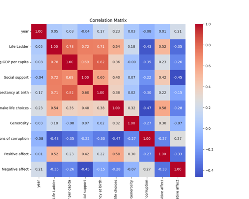

# Data Analysis of happiness.csv
The dataset under analysis comprises 2,363 entries spanning 14 columns, with a focus on key indicators of societal well-being across different countries. It encompasses variables such as Life Ladder, Log GDP per capita, and various measures of social support and happiness indices. Although the dataset is predominantly complete, some columns exhibit missing values, particularly in Generosity and Perceptions of corruption, indicating potential areas for further investigation. The data reflects trends from the year 2005 to 2023, offering a rich opportunity to explore correlations and insights related to economic, social, and psychological factors influencing quality of life on a global scale.
### Summary of Dataset Dimensions (happiness.csv)

- **Total Rows:** 2363
- **Total Columns:** 14 
- **Column Information:**
  - **Categorical Column:**
    - Country name (object)
  - **Numerical Columns:**
    - year (int64)
    - Life Ladder (float64)
    - Log GDP per capita (float64)
    - Social support (float64)
    - Healthy life expectancy at birth (float64)
    - Freedom to make life choices (float64)
    - Generosity (float64)
    - Perceptions of corruption (float64)
    - Positive affect (float64)
    - Negative affect (float64)
    - Anomaly (int64)
    - DBSCAN_Anomaly (int64)
    - SVM_Anomaly (int64)

- **Missing Values:**
  - Log GDP per capita: 28 missing
  - Social support: 13 missing
  - Healthy life expectancy at birth: 63 missing
  - Freedom to make life choices: 36 missing
  - Generosity: 81 missing
  - Perceptions of corruption: 125 missing
  - Positive affect: 24 missing
  - Negative affect: 16 missing

- **Statistical Overview:**
  - **Year Range:** 2005 to 2023
  - **Life Ladder Range:** Minimum 1.281, Maximum 8.019
  - **Additional key metrics available (mean, std, etc.) for other columns.**

## Contents
- [Missing Values Summary](#missing-values-summary)
- [Anomalies Detected](#anomalies-detected)
- [Graphs](#graphs)
- [Analysis Results](#analysis-results)
- [Recommnedations](#Recommnedations)

## Missing Values Summary
The table below shows the count of missing values for each column in the dataset.
| Column Name                      |   Missing Values |
|:---------------------------------|-----------------:|
| Country name                     |                0 |
| year                             |                0 |
| Life Ladder                      |                0 |
| Log GDP per capita               |               28 |
| Social support                   |               13 |
| Healthy life expectancy at birth |               63 |
| Freedom to make life choices     |               36 |
| Generosity                       |               81 |
| Perceptions of corruption        |              125 |
| Positive affect                  |               24 |
| Negative affect                  |               16 |
| Anomaly                          |                0 |
| DBSCAN_Anomaly                   |                0 |
| SVM_Anomaly                      |                0 |

## Anomalies Detected
Anomalies were detected using three methods. The results are summarized below:

### Isolation Forest
- Number of anomalies detected: **119**
- Method: Identifies anomalies by isolating data points through recursive partitioning.

### DBSCAN (Density-Based Spatial Clustering of Applications with Noise)
- Number of anomalies detected: **2287**
- Method: Identifies anomalies as points in low-density regions using density-based clustering.

### One-Class SVM (Support Vector Machine)
- Number of anomalies detected: **244**
- Method: Learns a decision boundary to separate normal data points from anomalies.

## Graphs
Here are some key visualizations:
  

## Analysis Results
### Comprehensive Analysis of the Dataset

**1. Dataset Overview:**
   - The dataset comprises **2363 rows** and **14 columns**.
   - It includes a combination of numerical (float64, int64) and categorical (object) data types.

**2. Correlations Between Numeric Variables:**
   - **Strong correlations (|r| > 0.5)**:
     - **Log GDP per capita** and **Life Ladder (r = 0.7836)**: Indicates that higher GDP per capita is associated with higher life satisfaction.
     - **Healthy life expectancy at birth** and **Life Ladder (r = 0.7149)**: Suggests that longer life expectancy correlates with greater happiness.
     - **Log GDP per capita** and **Healthy life expectancy (r = 0.8193)**: Displays a clear connection between economic prosperity and lifespan.
   - **Moderate correlations (0.3 < |r| < 0.5)**:
     - **Social support** and **Life Ladder (r = 0.7227)**: Reflects that stronger social networks contribute to higher life satisfaction.
     - **Freedom to make life choices** and **Life Ladder (r = 0.5382)**: Highlights the importance of personal freedom in influencing happiness.
   - **Negative correlations**:
     - **Perceptions of corruption** and **Life Ladder (r = -0.4305)**: Indicates that higher perceptions of corruption relate to lower life satisfaction.
     - **Negative affect** and **Life Ladder (r = -0.3524)**: Suggests that people reporting higher negative emotions tend to rate their life satisfaction lower.

**3. Feature Distributions for Numerical Data:**
   - **Means and Standard Deviations**:
     - Average **Life Ladder** score is **5.48** (SD = 1.12), showing moderate overall life satisfaction.
     - **Log GDP per capita** average is significant at **9.05** (SD = 0.30), indicating a variety of economic conditions across countries.
   - **Ranges**:
     - **Life Ladder** scores range from **1.28 to 8.02**, suggesting considerable differences in perceived quality of life.
     - **Log GDP per capita** ranges from approximately **7.64 to 10.12**.
   - **Skewness**: Scores like **Generosity** (mean = 0.12, SD = 0.23) show right skewness, implying most countries have low to moderate generosity levels.

**4. Identification of Outliers and Extreme Values:**
   - **Anomalies** detected through `Anomaly`, `DBSCAN_Anomaly`, and `SVM_Anomaly` columns, where:
     - DBSCAN anomaly shows a few extreme outliers (max = 12).
     - These anomalies should be inspected further as they may represent cases with unique influences.

**5. Trends in Missing Data:**
   - Notable missing values are present in:
     - **Generosity (81 missing)** and **Perceptions of corruption (125 missing)**, suggesting possible data collection issues or limitations in the survey methodology.
   - Missing data may bias results significantly in analyses involving these columns.

**6. Categorical Distributions:**
   - The dataset includes **165 unique countries**.
   - The mode for **Country name** is **Argentina** (frequent in 18 rows), indicating a potential focus on countries with recurring observations.

**7. General Observations:**
   - Overall, countries with better economic performance (high GDP), healthier populations, and stronger social support systems tend to report higher life satisfaction.
   - Negative emotions and perceptions of corruption are detrimental to life satisfaction scores.
   - Potential for exploring causal relationships through advanced statistical methods or machine learning, particularly to understand the contribution of mixed factors.

This analysis provides a structured approach to examine the dataset's core components, leading to potential avenues for further research and insights into wellbeing across different nations.

### Correlation

### Outliers
Outlier detection results:

## Recommnedations
Based on the dataset summary you provided, here are several recommendations for effectively analyzing and managing the dataset:

### Data Cleaning and Preprocessing
1. **Handle Missing Data**:
   - Consider various imputation methods for the columns with missing values:
     - **Log GDP per capita** (28 missing): Use the mean, median, or mode; alternatively, consider forward/backward filling if it's time-series data.
     - **Social support** (13 missing): Similar imputation as GDP.
     - **Healthy life expectancy at birth** (63 missing): Consider using interpolation or the mean/median of related countries or regions.
     - **Freedom to make life choices** (36 missing): Impute with the mean or median, or explore trends based on related variables.
     - **Generosity** (81 missing): Explore relationships with other variables before imputation.
     - **Perceptions of corruption** (125 missing): Consider calculating values based on country averages or other similar indicators.
     - **Positive affect** (24 missing) and **Negative affect** (16 missing): Evaluate if mean/median or carrying forward values is appropriate.

2. **Check for Duplicates**:
   - Ensure that there are no duplicate rows in the dataset that may skew analysis, especially since countries may appear across multiple years.

3. **Standardize Data Types**:
   - Ensure that all columns containing categorical data (e.g., Country name) are correctly formatted, and that numerical values across columns are consistently represented.

### Data Exploration
4. **Descriptive Statistics**:
   - Generate a more extensive report on descriptive statistics for each variable and segment them by country or year to uncover trends or patterns.

5. **Visualizing Data**:
   - Use visualization techniques such as:
     - Histograms and box plots for distributions of numerical columns.
     - Scatter plots to analyze relationships between key variables (e.g., Log GDP per capita vs. Life Ladder).
     - Heatmaps for correlation analysis to see how different factors relate to quality of life.

6. **Time Series Analysis**:
   - Given the year column, perform a time series analysis to see how various life indicators have changed over time for each country.

### Advanced Analysis
7. **Clustering and Grouping**:
   - Utilize clustering techniques (e.g., K-means, hierarchical clustering) to identify groups of countries with similar life indicators.
   - Investigate whether the DBSCAN and SVM anomaly columns provide insight into outlier behavior.

8. **Machine Learning**:
   - Consider using regression analysis to predict Life Ladder scores based on other factors.
   - Train classification models using anomaly detection algorithms to understand better which countries have extreme values for these variables.

### Reporting and Documentation
9. **Create a Comprehensive Report**:
   - Document findings, methodologies, and visualizations in a structured report highlighting key insights from the dataset.

10. **Invitation for Further Research**:
    - Highlight potential areas for further research, such as exploring socio-economic factors impacting the indicators and regional comparisons.

### Ethical Considerations
11. **Consider Demographic Implications**:
    - Be mindful of how your analysis might reflect on or impact communities when drawing conclusions based on socio-economic data.
  
By following these recommendations, you should be able to derive meaningful insights from the dataset while maintaining its integrity and usefulness for further analysis.

