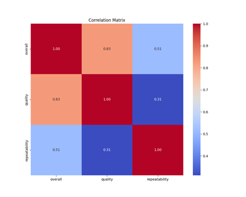

# Data Analysis of media.csv
This report presents an analysis of a dataset comprising 2,652 entries across 11 columns, capturing various attributes related to media content, including language, type, title, and user ratings. The dataset showcases a range of numerical variables such as overall ratings, quality, repeatability, and anomaly detection metrics derived from different algorithms. Notably, the dataset contains missing values in the 'date' and 'by' columns, which may impact the analysis. Key statistics reveal trends in the distribution of media types and language prevalence, while anomaly indicators provide insights into potential outliers within the dataset. This analysis aims to explore these dimensions and derive actionable insights from the available data.
Here is a concise summary of the dataset's dimensions:

- **Total Rows**: 2652
- **Total Columns**: 11
- **Data Types**:
  - Object: `date`, `language`, `type`, `title`, `by`
  - Integer: `overall`, `quality`, `repeatability`, `Anomaly`, `DBSCAN_Anomaly`, `SVM_Anomaly`
- **Missing Data**:
  - `date`: 99 missing values
  - `by`: 262 missing values
  - Other columns: No missing values
- **Unique Values**:
  - `date`: 2055 unique entries
  - `language`: 11 unique languages
  - `type`: 8 unique media types
  - `title`: 2312 unique titles
- **Statistical Overview**:
  - Numerical columns show various statistics (mean, min, max, std) indicating distribution and central tendencies. 

This summary encapsulates the structure and content of the dataset effectively.

## Contents
- [Missing Values Summary](#missing-values-summary)
- [Anomalies Detected](#anomalies-detected)
- [Graphs](#graphs)
- [Analysis Results](#analysis-results)
- [Recommnedations](#Recommnedations)

## Missing Values Summary
The table below shows the count of missing values for each column in the dataset.
| Column Name    |   Missing Values |
|:---------------|-----------------:|
| date           |               99 |
| language       |                0 |
| type           |                0 |
| title          |                0 |
| by             |              262 |
| overall        |                0 |
| quality        |                0 |
| repeatability  |                0 |
| Anomaly        |                0 |
| DBSCAN_Anomaly |                0 |
| SVM_Anomaly    |                0 |

## Anomalies Detected
Anomalies were detected using three methods. The results are summarized below:

### Isolation Forest
- Number of anomalies detected: **120**
- Method: Identifies anomalies by isolating data points through recursive partitioning.

### DBSCAN (Density-Based Spatial Clustering of Applications with Noise)
- Number of anomalies detected: **18**
- Method: Identifies anomalies as points in low-density regions using density-based clustering.

### One-Class SVM (Support Vector Machine)
- Number of anomalies detected: **326**
- Method: Learns a decision boundary to separate normal data points from anomalies.

## Graphs
Here are some key visualizations:
  

## Analysis Results
### Comprehensive Analysis of the Dataset

#### 1. **Correlations Between Numeric Variables**
- **Overall Quality**: There is a strong positive correlation (0.83) between `overall` and `quality`, indicating that higher quality ratings are associated with higher overall ratings.
- **Overall and Repeatability**: A moderate positive correlation (0.51) exists between `overall` and `repeatability`, suggesting that films that are rated more highly overall tend to have a higher repeatability score.
- **Anomaly Detection**: `Anomaly` shows a weak negative correlation with `overall` (-0.08) and `quality` (0.06), indicating little to no relationship between the anomaly scores and standard ratings.
- **DBSCAN and Repeatability**: A moderate positive correlation (0.55) was observed between `repeatability` and `DBSCAN_Anomaly`, suggesting that anomalies detected through DBSCAN may relate to the repeatability of assessments.
- **SVM and Quality**: `SVM_Anomaly` had a positive correlation with `overall` (0.44) and `quality` (0.40), pointing towards higher incidences of SVM-detected anomalies with higher ratings.

#### 2. **Feature Distributions for Numerical Data**
- **Overall Ratings**:
  - **Mean**: 6.68
  - **Standard Deviation**: 1.32
  - **Range**: Typically spans from a minimum of 1 to a maximum of 10.
- **Quality Ratings**:
  - **Mean**: 5.74
  - **Standard Deviation**: 1.21
  - **Range**: Values range from 1 to 10.
- **Repeatability**:
  - **Mean**: 1.49
  - **Standard Deviation**: 0.60
  - **Range**: Takes values from 1 to 3 (indicating levels of repeatability).
- **Anomaly Scores**: 
  - Values range from -1 to 1, with a mean around 0.91, suggesting few significant anomalies.
- **DBSCAN Anomaly Scores**:
  - Ranges widely with mean (5.22) and max values at 20, indicating potential outliers.
- **SVM Anomaly Scores**:
  - On average, represents a binary classification (-1 for no anomaly and 1 for an anomaly).

#### 3. **Identification of Outliers or Extreme Values**
- **DBSCAN Anomaly**: The maximum value of 20 stands out as an extreme score, which could represent unusual patterns not observed generally, necessitating further investigation on its impact.
- **SVM Anomaly Scores**: Negative values of -1 indicate no anomaly; hence, there may be instances where models are under performing on certain data points.

#### 4. **Trends in Missing Data or Categorical Distributions**
- **Missing Data**:
  - The variable `date` has 99 missing entries, which may affect time-based analysis.
  - The `by` column has 262 missing entries, indicating a significant proportion without associated creators, which could impact the overall analysis.
- **Categorical Distributions**:
  - Language distribution favors English, with 1306 occurrences, hinting at a bias towards English media.
  - Most entries are classified as 'movie' (2211 entries), indicating a predominance of film data in this dataset.

#### 5. **General Observations**
- High correlation between `overall` and `quality` ratings presents an opportunity for insights into the influences on perceived quality.
- The presence of some anomalous values, especially in the DBSCAN category, may warrant further investigation.
- Missing values highlight potential areas for data augmentation or imputation.
- The presence of multiple anomaly detection methods (DBSCAN, SVM) opens pathways for comparative performance analysis of these techniques, guiding future model selection.
  
### Conclusion
This dataset presents a multi-faceted view of ratings and anomalies within a film context. The analysis suggests strong relationships among ratings while highlighting certain qualities of the dataset that may need addressing for deeper insights. The existing missing data and outliers warrant attention to ensure robust conclusions in any subsequent analysis or modeling efforts.

### Correlation

### Outliers
Outlier detection results:

## Recommnedations
Based on the provided information about the dataset, here are some recommendations for data cleaning, analysis, and potential next steps:

### Data Cleaning

1. **Handle Missing Values**:
   - **Date Column**: There are 99 missing values in the 'date' column. If this column is critical for your analysis, consider either removing rows with missing dates or imputing them with appropriate values based on the context (e.g., using the mean or median date, or leveraging temporal associations).
   - **'by' Column**: There are 262 missing values in the 'by' column, which may represent the author or creator of the entries. You may choose to either remove these records or fill them with a placeholder (e.g., "Unknown") if the information is useful for your analysis.

2. **Data Type Conversion**:
   - Convert the 'date' column from object type to a datetime type for easier manipulation and analysis.
   - Check if the 'language' column can be categorized further if required for your analysis.

### Exploratory Data Analysis (EDA)

1. **Descriptive Statistics**:
   - Use descriptive statistics to summarize the key numerical columns (e.g., 'overall', 'quality', 'repeatability', etc.) beyond what is provided in your summary.

2. **Visualizations**:
   - Create visualizations (e.g., histograms, box plots) for numerical columns to explore distributions and identify outliers.
   - For categorical columns such as 'language' and 'type', bar charts can be useful to visualize the frequency of each category.

3. **Correlation Analysis**:
   - Investigate correlations between numerical columns to see how they relate to each other. This can help identify significant relationships that could inform modeling.

### Anomaly Detection Analysis

1. **Evaluate Anomalies**:
   - Analyze the columns `Anomaly`, `DBSCAN_Anomaly`, and `SVM_Anomaly` to determine how these anomalies are defined and how they relate to the key performance indicators you may have in your dataset.
   - Review the thresholds used for anomaly detection. If they can be adjusted, assess the impact of those changes.

2. **Further Testing**:
   - If the anomalies are significant, you might want to consider more robust anomaly detection techniques or model the data to reduce false positives/negatives.

### Modeling and Predictions

1. **Predictive Modeling**:
   - Depending on the goals of your analysis, you may want to create predictive models that use columns like 'overall', 'quality', and 'repeatability' as features to predict a target variable (such as anomalies).

2. **Machine Learning**:
   - With a clean dataset, consider applying machine learning techniques (e.g., classification or regression) to identify patterns or make predictions based on the data features.

### Documentation and Reporting

1. **Document Findings**:
   - Ensure to document any findings throughout your analysis, particularly any trends or insights related to anomalies, ratings, or types of entries.

2. **Report Results**:
   - Prepare a report or presentation of your findings that includes visualizations and actionable insights, especially highlighting how the data could be utilized in practical applications.

By following these recommendations, you can enhance the quality of your dataset and derive meaningful insights from it.

